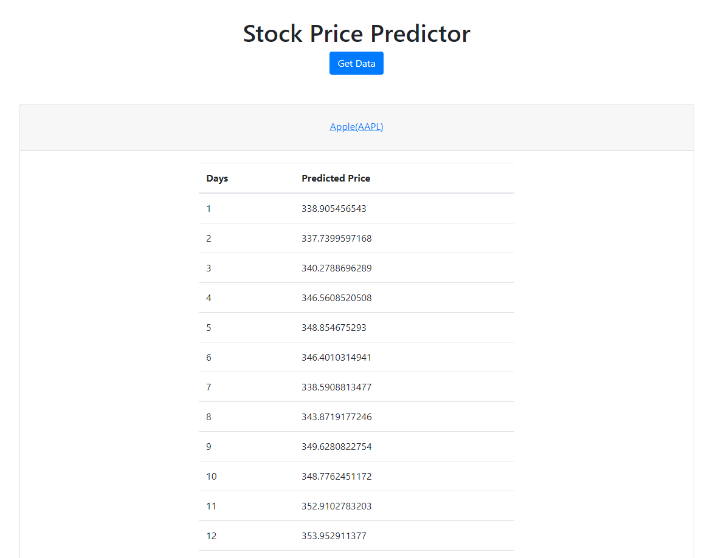

# Stock Price Predictor

This GitHub Repository contains my final project for Udacity's Machine Learning Engineer Nanodegree.

This is a Stock Price Predictor. It uses Amazon's DeepAR algorithm to create a model and forecast future stock prices. This repository contains a [Jupiter Notebook](./stock-forecasting-deepar.ipynb) used to gather the data, train a model, and evaluate it. This notebook also contains a web app which can be deployed to predict stock prices up to 30 trading days in the future.

- [Report](./report.pdf)
- [Jupiter Notebook](./stock-forecasting-deepar.ipynb)

# Web App Setup Instructions

To run this Web App you must first create and deploy a model. There are a few requirements before you get started.

## RapidAPI

You must sign up for [RapidAPI](https://rapidapi.com/). Create an account and subscribe to the [Yahoo Finance API](https://rapidapi.com/apidojo/api/yahoo-finance1). You will need your `RAPIDAPI-HOST` and `RAPIDAPI-KEY` in the Jupiter Notebook for training your model.

## SageMaker

You must also have an [Amazon Web Services](https://aws.amazon.com/) (AWS) account. Create an account and navigate to Amazon SageMaker from your AWS Console. Create a Notebook Instance. On the Create a Notebook Instance page, click **Git repositories** and select Clone a public *Git repository to this notebook instance only*. In **Git repository URL** type in `https://github.com/scliff108/Udacity-ML-Capstone-Project.git`. Finally, create the notebook instance.

### Create the Model

Once the Notebook instance is setup, open the `stock-forecasting-deepar` notebook. Be sure to enter your `RAPIDAPI-HOST` and `RAPIDAPI-KEY` in the `load_historical_data` function under the heading **Load and Explore the Data**. 

After that, you can run all the cells in the Notebook. After about 15 minutes, you should have a model generated and evaluated.

### Setup Lambda

Now that you have a model trained, you will need to create a Lambda function to send data to the SageMaker endpoint and return the result. Copy and paste the code below into a Lambda function on AWS. You will need to enter your **S3 Bucket** and your **Predictor Endpoint Name** in the code provided.

```
import boto3
import os
import sys
import json

s3 = boto3.resource('s3')

def lambda_handler(event, context):
    
    bucket = ''# YOUR BUCKET HERE
    key = 'lambda-deepar-stock-forecasting/test/test.json'
    obj = s3.Object(bucket, key)
    
    file_content = obj.get()['Body'].read().decode('utf-8')
    instances = file_content.splitlines()
    
    instances = [json.loads(i) for i in instances]
    for i in instances:
        for _ in range(30):
            i['dynamic_feat'][0].append(i['dynamic_feat'][0][-1])
    
    configuration = {'num_samples': 30,
                     'output_types': ['mean'],
                    }
                    
    request_data = {'instances': instances,
                    'configuration': configuration
                   }

    payload = json.dumps(request_data).encode('utf-8')

    runtime = boto3.Session().client('sagemaker-runtime')
    response = runtime.invoke_endpoint(EndpointName = '', # YOUR ENDPOINT NAME HERE
                                       ContentType = 'application/json',
                                       Body = payload
    )
    result = response['Body'].read().decode('utf-8')

    return {
        'statusCode': 200,
        'body': result
    }

```

### Lambda Data

Unfortunately, Lambda can only handle so much data, so we have to provide less data to the DeepAR predictor than what we have on S3. To do this, open the `lambda-data` notebook. Again, enter your RapidAPI information and run all the cells. This will upload data that is small enough for Lambda to handle.

### API Gateway

Finally, we can set up API Gateway to trigger the Lambda function we created and get Stock Price Predictions. To do this, create a new POST method and make sure Lambda Function is selected. Then, enter the name of your Lambda Function into the text box and click save. Finally, click the Actions dropdown to Deploy API.

You will need the **Invoke URL** to deploy your Web App.

## Web App

Now that you have an API available, you can start using it in a web app. I have made a very simple HTML and JavaScript file to interact with the API. Download the website folder from this GitHub Repository, add your Public API URL where indivated in the file and open it. When you click the **Get Data** button, you should see the 20 stocks in an accordian. Click on the stock to see the predicted prices.

Your web app will look like this to start.


After you click the **Get Data** button, your web app will look like this.


After clicking on a stock your web app will look like this.


